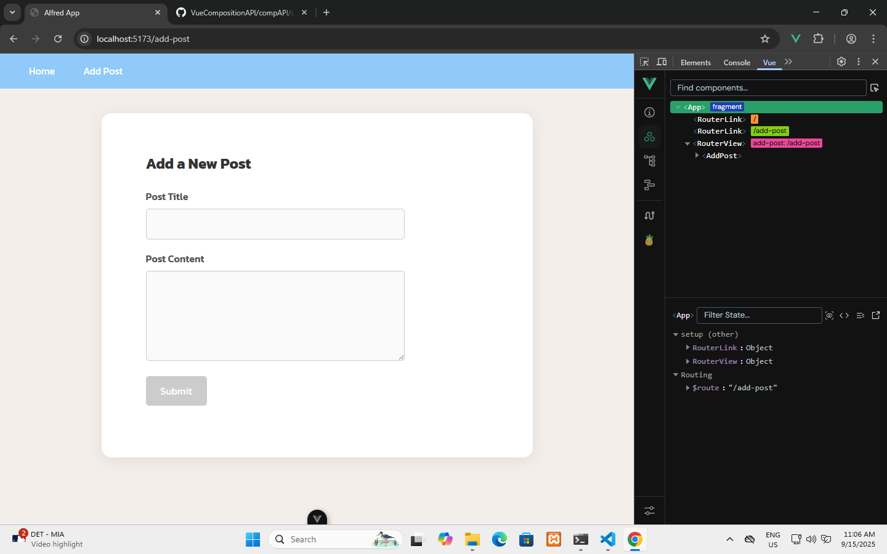
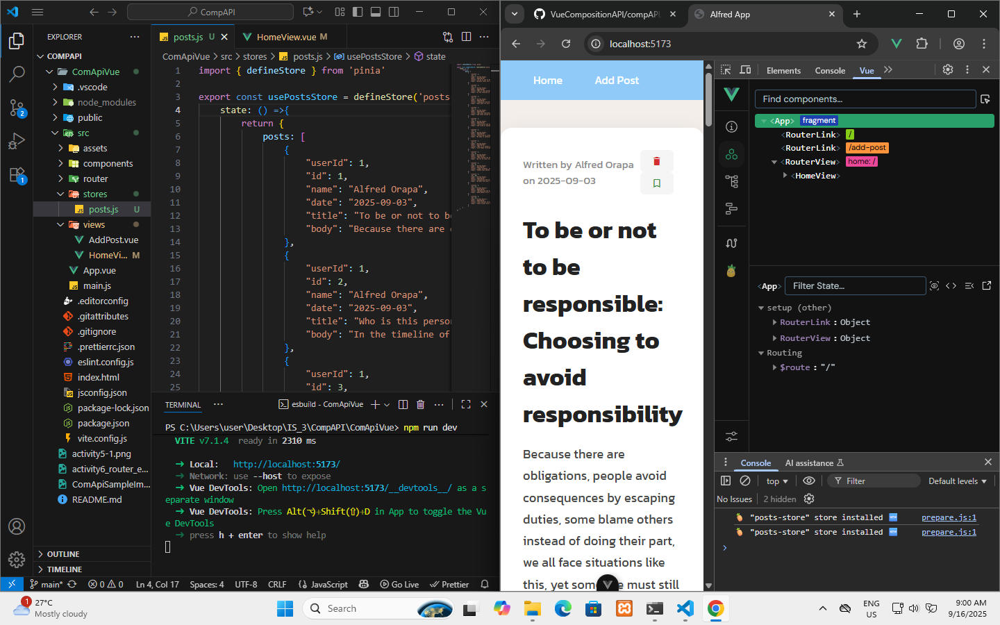

# CompAPI Vue

## Overview

CompAPI Vue is a simple Vue 3 application that displays a list of posts in a card-style layout. Each post shows the author, date, title, and body. The UI includes buttons for deleting and saving posts (currently without functionality).

## Features

- Vue 3 + Vite project structure
- Vue Router for navigation
- SCSS styling for modern card layout
- Posts list with author, date, title, and body

## Getting Started

### Prerequisites

- Node.js (v16+ recommended)
- npm or yarn

### Installation

1. Clone the repository:
   ```
   git clone https://github.com/Alfred3002/CompositionAPI.git
   ```
2. Go to the project folder:
   ```
   cd CompAPI/ComApiVue
   ```
3. Install dependencies:
   ```
   npm install
   ```
   or
   ```
   yarn install
   ```

### Running the App

Start the development server:
```
npm run dev
```
or
```
yarn dev
```

Open [http://localhost:5173](http://localhost:5173) in your browser.

## Project Structure

```
ComApiVue/
├── src/
│   ├── App.vue
│   ├── views/
│   │   └── HomeView.vue
│   └── ...
├── package.json
└── ...
```

## Customization

- **Add more posts:** Edit `src/views/HomeView.vue` and update the `posts` array.
- **Add functionality:** Implement delete/save logic in the `<script setup>` section of `HomeView.vue`.

## License

This project is for educational purposes.

```
**Made with Vue 3 &
```
### Sample Image of what it look like

### Sample Image for Activity 4


## Sample Image for Activity 5


### Sample Image for Activity 6 vue router and emit 



### Sample Image for Activity 7 From Pinia to Pinia Getters

